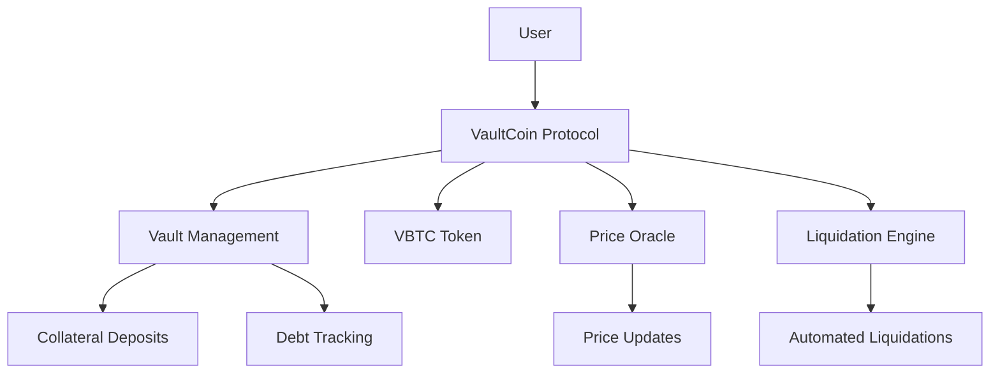

# VaultCoin Synthetic Asset Protocol

[](https://clarity-lang.org/)
[](LICENSE)
[](https://vitest.dev/)

A sophisticated decentralized protocol for issuing Bitcoin-backed synthetic assets with dynamic collateral management and automated risk mitigation systems on the Stacks blockchain.

## Overview

VaultCoin enables users to mint synthetic Bitcoin tokens (VBTC) through an over-collateralized vault system. The protocol features real-time price discovery, automated liquidation mechanisms, and dynamic collateral ratios to maintain peg stability. Users can deposit BTC as collateral to mint VBTC tokens, which track Bitcoin's value while remaining liquid and transferable.

### Key Features

- **🏦 Over-Collateralized Vaults**: Secure vault system with minimum 120% collateralization ratio
- **⚡ Synthetic Bitcoin Tokens**: Mint VBTC tokens backed by BTC collateral
- **🔄 Dynamic Collateral Management**: Flexible collateral ratios between 120%-300%
- **🚨 Automated Liquidations**: Protect protocol solvency with automated liquidation system
- **🛡️ Emergency Safeguards**: Protocol-level emergency shutdown mechanisms
- **📊 Real-time Analytics**: Comprehensive vault and protocol statistics
- **🎯 Precise Price Oracle**: Built-in price feed system with staleness protection

## Architecture

### Core Components



### Smart Contract Structure

- **Core Token**: `vault-btc` fungible token representing synthetic Bitcoin
- **Vault System**: Individual user vaults tracking collateral and debt
- **Price Oracle**: Real-time BTC price feed with staleness protection
- **Liquidation Engine**: Automated liquidation system for under-collateralized positions
- **Governance**: Administrative functions for protocol parameters

## Getting Started

### Prerequisites

- [Clarinet CLI](https://docs.hiro.so/clarinet) v2.0+
- [Node.js](https://nodejs.org/) v18+
- [Git](https://git-scm.com/)

### Installation

1. **Clone the repository**

   ```bash
   git clone https://github.com/promise-code/vault-coin.git
   cd vault-coin
   ```

2. **Install dependencies**

   ```bash
   npm install
   ```

3. **Run tests**

   ```bash
   npm test
   ```

4. **Check contracts**

   ```bash
   clarinet check
   ```

### Quick Start

1. **Deploy the contract** (local development)

   ```bash
   clarinet console
   ```

2. **Initialize price feed** (as contract owner)

   ```clarity
   (contract-call? .vault-coin update-price-feed)
   ```

3. **Mint synthetic BTC**

   ```clarity
   (contract-call? .vault-coin mint-synthetic-btc u1000000 u500000)
   ;; Deposit 1 BTC collateral, mint 0.5 VBTC
   ```

## Protocol Mechanics

### Collateralization

The protocol maintains system stability through over-collateralization:

- **Minimum Ratio**: 120% (adjustable by governance)
- **Default Ratio**: 150%
- **Maximum Ratio**: 300%
- **Liquidation Threshold**: Below 120%

### Vault Operations

#### Creating a Vault

```clarity
;; Deposit 1 BTC collateral and mint 0.6 VBTC
(contract-call? .vault-coin mint-synthetic-btc u1000000 u600000)
```

#### Redeeming Collateral

```clarity
;; Burn 0.3 VBTC and withdraw 0.5 BTC collateral
(contract-call? .vault-coin redeem-synthetic-btc u300000 u500000)
```

#### Checking Vault Status

```clarity
;; Get vault information for a user
(contract-call? .vault-coin get-vault-info 'SP1HTBVD3JG9C05J7HBJTHGR0GGW7KXW28M5JS8QE)
```

### Liquidation System

Vaults below the minimum collateralization ratio (120%) can be liquidated by anyone:

```clarity
;; Liquidate an under-collateralized vault
(contract-call? .vault-coin liquidate-vault 
    'SP1HTBVD3JG9C05J7HBJTHGR0GGW7KXW28M5JS8QE 
    u100000)
```

**Liquidation Incentives:**

- **Penalty**: 10% of debt value
- **Liquidator Reward**: Collateral + penalty
- **Partial Liquidations**: Supported for large positions

## API Reference

### Public Functions

#### `mint-synthetic-btc`

Creates or adds to an existing vault and mints VBTC tokens.

**Parameters:**

- `collateral-amount` (uint): Amount of BTC collateral to deposit
- `mint-amount` (uint): Amount of VBTC tokens to mint

**Returns:** Vault operation summary

#### `redeem-synthetic-btc`

Burns VBTC tokens and withdraws collateral from vault.

**Parameters:**

- `burn-amount` (uint): Amount of VBTC tokens to burn
- `withdraw-collateral` (uint): Amount of collateral to withdraw

**Returns:** Redemption operation summary

#### `liquidate-vault`

Liquidates an under-collateralized vault.

**Parameters:**

- `vault-owner` (principal): Address of the vault to liquidate
- `max-debt-to-clear` (uint): Maximum debt amount to clear

**Returns:** Liquidation operation summary

### Read-Only Functions

#### `get-vault-info`

Returns comprehensive vault information for a user.

#### `get-protocol-stats`

Returns global protocol statistics including total collateral and supply.

#### `calculate-max-mintable`

Calculates the maximum VBTC amount mintable for given collateral.

#### `is-vault-liquidatable`

Checks if a vault is eligible for liquidation.

### Administrative Functions

#### `update-collateral-ratio`

Updates the global collateral ratio (owner only).

#### `emergency-shutdown-protocol`

Activates emergency shutdown mode (owner only).

#### `update-price-feed`

Updates the BTC price feed timestamp (owner only).

## Testing

The project includes comprehensive test coverage using Vitest and Clarinet SDK.

### Running Tests

```bash
# Run all tests
npm test

# Run tests with coverage report
npm run test:report

# Watch mode for development
npm run test:watch
```

### Test Structure

```
tests/
├── vault-coin.test.ts          # Core protocol tests
├── liquidation.test.ts         # Liquidation mechanism tests
├── governance.test.ts          # Administrative function tests
└── edge-cases.test.ts          # Edge case and error handling tests
```

## Security Considerations

### Risk Mitigation

1. **Over-Collateralization**: Minimum 120% collateral ratio
2. **Price Oracle**: Staleness protection with 24-hour timeout
3. **Emergency Shutdown**: Protocol-level emergency controls
4. **Liquidation Incentives**: Economic incentives for maintaining solvency
5. **Input Validation**: Comprehensive parameter validation

### Known Limitations

- Price oracle dependency for external BTC price feeds
- Centralized price update mechanism (temporary)
- Single collateral type (BTC only)

## Governance

The protocol includes governance mechanisms for parameter adjustment:

- **Collateral Ratio**: Adjustable between 120%-300%
- **Emergency Controls**: Shutdown and resume capabilities
- **Price Feed**: Oracle update mechanisms

## Roadmap

### Phase 1: Core Protocol ✅

- [x] Basic vault operations
- [x] Liquidation system
- [x] Price oracle integration
- [x] Emergency safeguards

### Phase 2: Enhanced Features 🚧

- [ ] Multiple collateral types
- [ ] Decentralized price feeds
- [ ] Governance token
- [ ] Yield optimization

### Phase 3: Advanced Features 📋

- [ ] Cross-chain collateral
- [ ] Flash loan integration
- [ ] Insurance mechanisms
- [ ] Advanced analytics dashboard

## Contributing

We welcome contributions! Please see our [Contributing Guide](CONTRIBUTING.md) for details.

### Development Setup

1. Fork the repository
2. Create a feature branch: `git checkout -b feature/new-feature`
3. Make your changes and add tests
4. Run the test suite: `npm test`
5. Submit a pull request

### Code Style

- Follow Clarity best practices
- Include comprehensive tests for new features
- Update documentation for API changes
- Use descriptive commit messages

## License

This project is licensed under the MIT License - see the [LICENSE](LICENSE) file for details.

## Resources

- [Stacks Documentation](https://docs.stacks.co/)
- [Clarity Language Reference](https://docs.stacks.co/clarity)
- [Clarinet Developer Tools](https://docs.hiro.so/clarinet)
- [Stacks.js SDK](https://github.com/hirosystems/stacks.js)

---

**Disclaimer**: This software is experimental and has not been audited. Use at your own risk. Always conduct thorough testing before deploying to mainnet.
